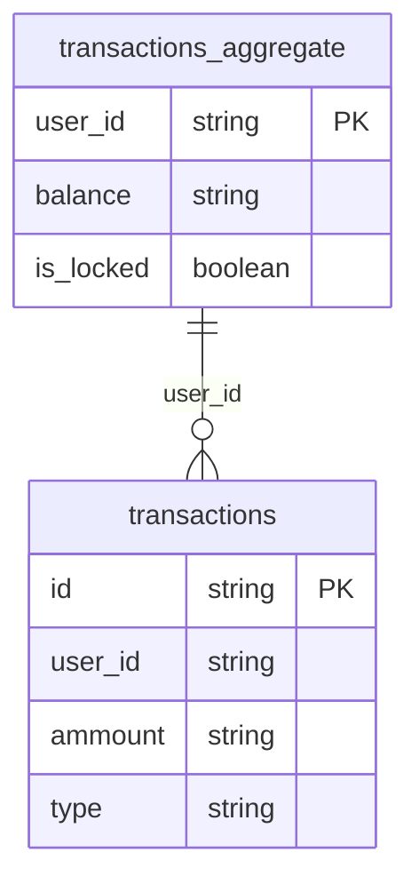
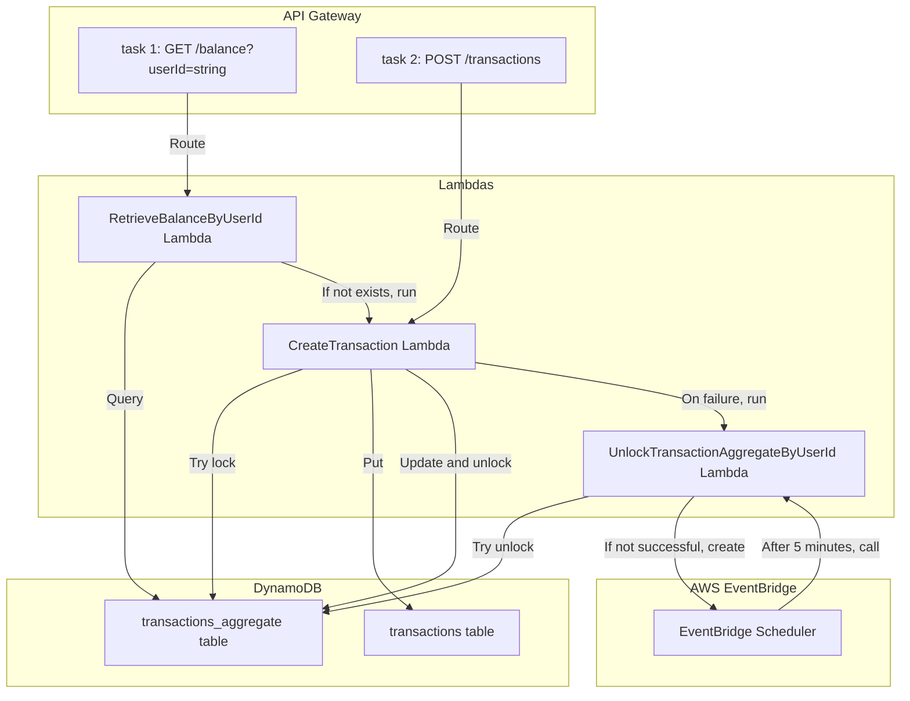

# The challenge

## Task 1: Retrieve Current Balance Function 

You are tasked with creating an AWS Lambda function integrated with AWS API Gateway in TypeScript that retrieves the current balance for a user. 
The function should: 
- Retrieve the current balance for the specified user from a DynamoDB table. 
- Have a default balance of 100 USD.

The function input will be as followed: 

```ts 
{
    queryStringParameters: {
        userId: '1'
    }
} 
```  

## Task 2: Transact Function 

You are also required to create an AWS Lambda function integrated with AWS API Gateway in TypeScript for processing transactions. 
The transact function should: 
- Handle credits & debits. 
- Process the transaction in an idempotent way to prevent duplicate transactions. 
- Make sure the user balance can't drop below 0. 
- Make sure no race conditions can happen.

The function input will be as followed: 
```ts
{
    headers: {
        'Idempotent-Key': '1'
    }
    body: {
        userId: '1', 
        ammount: '10', 
        type: 'credit', 
    }
} 
``` 

# The ER diagram



# The project structure

[Clean architecture](https://blog.cleancoder.com/uncle-bob/2012/08/13/the-clean-architecture.html) with a bit of [DDD](https://martinfowler.com/bliki/DomainDrivenDesign.html).

```
.
├── src
│   ├── handlers // Responsible to be the entrypoint of the application (Lambda handlers)
│   │   ├── create-transaction.ts
│   │   └── [...]
│   ├── models // Responsible to represent the entities and DTO's used internally by the application
│   │   ├── create-transaction-input.ts
│   │   └── [...]
│   ├── repositories // Responsible to connect with the database according to it's entity relationed to a database table
│   │   ├── transactions-aggregate.repository.ts
│   │   └── [...]
│   ├── services // Responsible to abstract operations that can be helpfull for usecases 
│   │   ├── context.service.ts
│   │   └── [...]
│   ├── usecases // Responsible to abstract entrypoint main objective
│   │   ├── create-transaction.usecase.ts
│   │   └── [...]
│   ├── utils // Generic code that can be helpfull to the whole application
│   │   ├── obj-to-class-converter.utils.ts
│   │   └── [...]
│   └── validators // Responsible to retain custom input validators
│       ├── is-big-decimal-greater-than-zero.validator.ts
│       └── [...]
└── tests
    ├── integration // I decided to create a suite for each task number for ease of translate requirements into scenarios
    │   ├── task-1.spec.ts
    │   └── [...]
    └── unit
        ├── handlers // Each unit test suite should replicate src folder structure to be easier to find
        │   └── [...]
        └── [...]
```

# The solution architecture



## How to run unit tests (minimal setup)

- Install [Node.js](https://nodejs.org/en/download)
- Install [Typescript](https://www.typescriptlang.org/download/)
- On root project folder, run following commands:

```bash
npm ci && npm test
```


## How to run integration tests (minimal setup + additional steps)

- Install [Terraform](https://developer.hashicorp.com/terraform/tutorials/aws-get-started/install-cli)
- [Use or create an IAM user](https://docs.aws.amazon.com/IAM/latest/UserGuide/id_users_create.html) with following permissions (replace account_id and aws_region placeholders):
```json
{
    "Version": "2012-10-17",
    "Statement": [
        {
            "Sid": "VisualEditor0",
            "Effect": "Allow",
            "Action": [
                "apigateway:DELETE", // If you want to destroy API Gateway resources
                "apigateway:GET",
                "apigateway:PATCH", // If you want to update API Gateway resources
                "apigateway:POST",
                "apigateway:PUT", // If you want to update API Gateway resources
                "apigateway:UpdateRestApiPolicy", // If you want to update API Gateway resources
                "dynamodb:CreateTable",
                "dynamodb:DeleteTable", // If you want to destroy DynamoDB tables
                "dynamodb:DescribeContinuousBackups",
                "dynamodb:DescribeTable",
                "dynamodb:DescribeTimeToLive",
                "dynamodb:ListTagsOfResource",
                "dynamodb:UpdateTable", // If you want to update DynamoDB tables
                "iam:CreateRole",
                "iam:DeleteRole", // If you want to destroy IAM roles
                "iam:DeleteRolePolicy", // If you want to destroy IAM role policies
                "iam:GetRole",
                "iam:GetRolePolicy",
                "iam:ListAttachedRolePolicies",
                "iam:ListInstanceProfilesForRole",
                "iam:ListRolePolicies",
                "iam:PassRole",
                "iam:PutRolePolicy", // If you want to update IAM role policies
                "iam:UpdateAssumeRolePolicy", // If you want to update IAM role policies
                "lambda:AddPermission",
                "lambda:CreateFunction",
                "lambda:DeleteFunction", // If you want to destroy Lambda functions
                "lambda:DeleteLayerVersion", // If you want to destroy Lambda layers
                "lambda:GetFunction",
                "lambda:GetFunctionCodeSigningConfig",
                "lambda:GetLayerVersion",
                "lambda:GetPolicy",
                "lambda:ListTags",
                "lambda:ListVersionsByFunction",
                "lambda:PublishLayerVersion",
                "lambda:RemovePermission", // If you want to destroy Lambda permissions
                "lambda:UpdateFunctionCode", // If you want to update Lambda code
                "lambda:UpdateFunctionConfiguration", // If you want to update Lambda config
                "s3:DeleteObjectVersion", // If you want to destroy S3 object versions
                "s3:GetObject",
                "s3:GetObjectTagging",
                "s3:ListBucketVersions",
                "s3:PutObject" // If you want to update Lambda code or layer
            ],
            "Resource": [
                "arn:aws:apigateway:${aws_region}::/restapis",
                "arn:aws:apigateway:${aws_region}::/restapis/*",
                "arn:aws:dynamodb:${aws_region}:${account_id}:table/transactions_aggregate",
                "arn:aws:dynamodb:${aws_region}:${account_id}:table/transactions",
                "arn:aws:iam::${account_id}:role/CreateTransactionLambdaExecutionRole",
                "arn:aws:iam::${account_id}:role/RetrieveBalanceByUserIdLambdaExecutionRole",
                "arn:aws:iam::${account_id}:role/UnlockTransactionAggregateByUserIdLambdaExecutionRole",
                "arn:aws:lambda:${aws_region}:${account_id}:function:CreateTransactionLambda",
                "arn:aws:lambda:${aws_region}:${account_id}:function:RetrieveBalanceByUserIdLambda",
                "arn:aws:lambda:${aws_region}:${account_id}:function:UnlockTransactionAggregateByUserIdLambda"
                "arn:aws:lambda:${aws_region}:${account_id}:layer:TransactionsChallengeLayer",
                "arn:aws:s3:::transactions-challenge-lambda-store",
                "arn:aws:s3:::transactions-challenge-lambda-store/*"
            ]
        }
    ]
}
```
- [Generate access key and secret from created user](https://docs.aws.amazon.com/IAM/latest/UserGuide/id_credentials_access-keys.html) and inject into .env.test.integration file
- [Create S3 bucket](https://docs.aws.amazon.com/AmazonS3/latest/userguide/create-bucket-overview.html) with:
    - The name transactions-challenge-lambda-store
    - [Versioning](https://docs.aws.amazon.com/AmazonS3/latest/userguide/Versioning.html)
    - [Public access blocked](https://docs.aws.amazon.com/AmazonS3/latest/userguide/access-control-block-public-access.html?icmpid=docs_amazons3_console)
- Run following command:

```bash
npm run test:integration
```

## How to validate scheduler flow

- Set **TEST_SCHEDULER** env var to _true_ on Terraform according to each Lambda function:
    - [CreateTransactionLambda](https://github.com/ian-rossi/transactions-challenge/blob/main/tests/integration/infra/step-3-create-transaction-lambda.tf#L35)
    - [RetrieveBalanceByUserIdLambda](https://github.com/ian-rossi/transactions-challenge/blob/main/tests/integration/infra/step-4-create-retrieve-balance-by-user-id-lambda.tf#L41)
    - [UnlockTransactionAggregateByUserIdLambda](https://github.com/ian-rossi/transactions-challenge/blob/main/tests/integration/infra/step-5-create-unlock-transaction-aggregate-by-user-id-lambda.tf#L61)

    **Obs.**: this requires the current AWS user to have permission for action lambda:UpdateFunctionConfiguration on following resources (replace account_id and aws_region placeholders):

    - arn:aws:lambda:{aws_region}:{account_id}:function:CreateTransactionLambda
    - arn:aws:lambda:{aws_region}:{account_id}:function:RetrieveBalanceByUserIdLambda
    - arn:aws:lambda:{aws_region}:{account_id}:function:UnlockTransactionAggregateByUserIdLambda

- Run following command:

```bash
npm run test:integration
```
 
- Verify created schedulers on [AWS EventBridge Schedulers](https://docs.aws.amazon.com/pt_br/scheduler/latest/UserGuide/what-is-scheduler.html#acessing-servicename)
 
- After 5 minutes, verify scheduler execution statuses on log group **/aws/lambda/UnlockTransactionAggregateByUserIdLambda** at [AWS CloudWatch Logs](https://docs.aws.amazon.com/pt_br/AmazonCloudWatch/latest/logs/WhatIsCloudWatchLogs.html)

