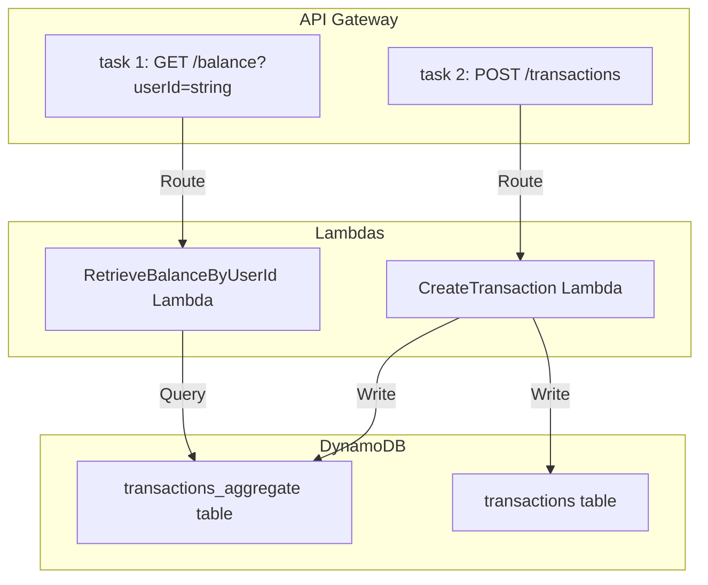

# The solution architecture

For better view, have a look on [Mermaid](https://www.mermaidchart.com/).


```mermaid
graph TD
    subgraph API Gateway
        GET_BALANCE[task 1: GET /balance?userId=string]
        POST_TRANSACTIONS[task 2: POST /transactions]
    end

    subgraph Lambdas
        RetrieveBalanceByUserId[RetrieveBalanceByUserId Lambda]
        CreateTransaction[CreateTransaction Lambda]
    end

    subgraph DynamoDB
        TransactionsAggregateTable[transactions_aggregate table]
        TransactionsTable[transactions table]
    end

    GET_BALANCE -->|Route| RetrieveBalanceByUserId
    POST_TRANSACTIONS -->|Route| CreateTransaction
    RetrieveBalanceByUserId -->|Query| TransactionsAggregateTable
    CreateTransaction -->|Write| TransactionsTable
    CreateTransaction -->|Write| TransactionsAggregateTable
```
## How to run unit tests (minimal setup)

- Install [Node.js](https://nodejs.org/en/download)
- Install [Typescript](https://www.typescriptlang.org/download/)
- On root project folder, run following commands:

```bash
npm ci && npm test
```


## How to run integration tests (minimal setup + additional steps)

- Install [Terraform](https://developer.hashicorp.com/terraform/tutorials/aws-get-started/install-cli)
- [Use or create an IAM user](https://docs.aws.amazon.com/IAM/latest/UserGuide/id_users_create.html) with following permissions (replace account_id and aws_region placeholders):
```json
{
    "Version": "2012-10-17",
    "Statement": [
        {
            "Sid": "VisualEditor0",
            "Effect": "Allow",
            "Action": [
                "apigateway:DELETE",
                "apigateway:GET",
                "apigateway:PATCH",
                "apigateway:POST",
                "apigateway:PUT",
                "apigateway:UpdateRestApiPolicy",
                "dynamodb:CreateTable",
                "dynamodb:DeleteTable",
                "dynamodb:DescribeContinuousBackups",
                "dynamodb:DescribeTable",
                "dynamodb:DescribeTimeToLive",
                "dynamodb:ListTagsOfResource",
                "dynamodb:UpdateTable",
                "iam:CreateRole",
                "iam:DeleteRole",
                "iam:DeleteRolePolicy",
                "iam:GetRole",
                "iam:GetRolePolicy",
                "iam:ListAttachedRolePolicies",
                "iam:ListInstanceProfilesForRole",
                "iam:ListRolePolicies",
                "iam:PassRole",
                "iam:PutRolePolicy",
                "lambda:AddPermission",
                "lambda:CreateFunction",
                "lambda:CreateEventSourceMapping",
                "lambda:DeleteEventSourceMapping",
                "lambda:DeleteFunction",
                "lambda:DeleteLayerVersion",
                "lambda:GetFunction",
                "lambda:GetFunctionCodeSigningConfig",
                "lambda:GetLayerVersion",
                "lambda:GetPolicy",
                "lambda:ListTags",
                "lambda:ListVersionsByFunction",
                "lambda:PublishLayerVersion",
                "lambda:RemovePermission",
                "lambda:UpdateEventSourceMapping",
                "lambda:UpdateFunctionCode",
                "lambda:UpdateFunctionConfiguration",
                "s3:DeleteObjectVersion",
                "s3:GetObject",
                "s3:GetObjectTagging",
                "s3:ListBucketVersions",
                "s3:PutObject"
            ],
            "Resource": [
                "arn:aws:apigateway:${aws_region}::/restapis",
                "arn:aws:apigateway:${aws_region}::/restapis/*",
                "arn:aws:dynamodb:${aws_region}:${account_id}:table/transactions_aggregate",
                "arn:aws:dynamodb:${aws_region}:${account_id}:table/transactions",
                "arn:aws:iam::${account_id}:role/CreateOrUpdateTransactionsAggregateExecutionRole",
                "arn:aws:iam::${account_id}:role/CreateTransactionExecutionRole",
                "arn:aws:iam::${account_id}:role/RetrieveBalanceByUserIdExecutionRole",
                "arn:aws:lambda:${aws_region}:${account_id}:event-source-mapping:*",
                "arn:aws:lambda:${aws_region}:${account_id}:function:CreateOrUpdateTransactionsAggregateLambda",
                "arn:aws:lambda:${aws_region}:${account_id}:function:CreateTransactionLambda",
                "arn:aws:lambda:${aws_region}:${account_id}:function:RetrieveUserBalanceByUserIdLambda",
                "arn:aws:lambda:${aws_region}:${account_id}:layer:JacksClubAssessmentLayer:*",
                "arn:aws:lambda:${aws_region}:${account_id}:layer:JacksClubAssessmentLayer",
                "arn:aws:s3:::jacks-club-assessment-lambda-store",
                "arn:aws:s3:::jacks-club-assessment-lambda-store/*"
            ]
        },
		{
			"Sid": "VisualEditor1",
			"Effect": "Allow",
			"Action": [
				"lambda:GetEventSourceMapping"
			],
			"Resource": ["*"]
		}
    ]
}
```
- [Generate access key and secret from created user](https://docs.aws.amazon.com/IAM/latest/UserGuide/id_credentials_access-keys.html) and inject into .env.test.integration
- [Create S3 bucket](https://docs.aws.amazon.com/AmazonS3/latest/userguide/create-bucket-overview.html) with:
    - The name jacks-club-assessment-lambda-store
    - [Versioning](https://docs.aws.amazon.com/AmazonS3/latest/userguide/Versioning.html)
    - [Public acess blocked](https://docs.aws.amazon.com/AmazonS3/latest/userguide/access-control-block-public-access.html?icmpid=docs_amazons3_console)
- Run following command:

```bash
npm run test:integration
```